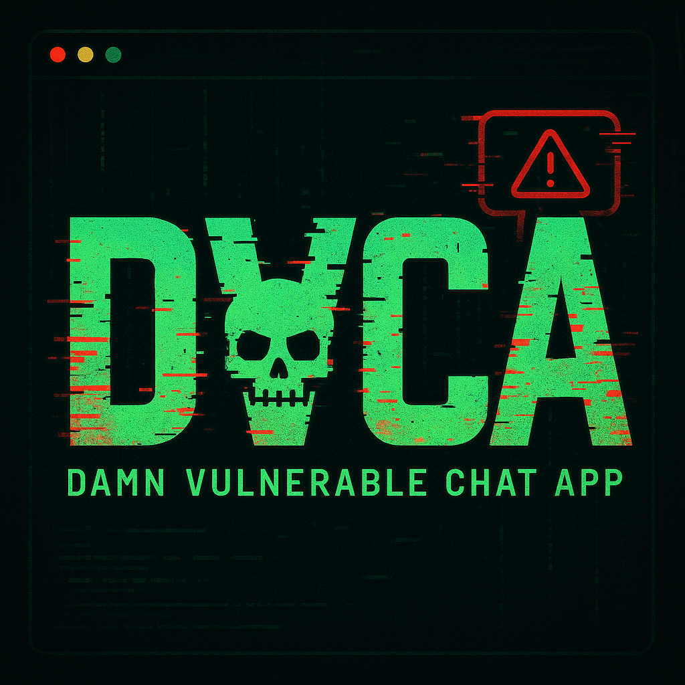

DVCA - Damn Vulnerable Chat App

A full-stack, real-time, purposely insecure chat application built with Go, WebSockets, SQLite, and a terminal-style frontend. Designed for learning, hacking, and red team/CTF-style training.

Features

Feature

Purpose

WebSocket-based Chat

Real-time backend logic in Go

Fake JWT Auth System

Token tampering & privilege escalation demo

Admin Panel + Flag

Broken access control + reward system

AI Bot Microservice

Responds to @ai commands insecurely

SQLite + Go API

Stores messages, allows SQLi

Insecure Endpoints

Perfect for Postman, Burp, or curl testing

Setup Instructions

1. Clone the repo

git clone https://github.com/yourusername/dvca.git
cd dvca

2. Install dependencies

go mod tidy

3. Run the servers

Terminal 1: WebSocket Chat Server

cd cmd/chatserver
go run main.go

Terminal 2: API Server (SQLite)

cd cmd/api
go run dvca-api.go

Terminal 3: DVCA Bot

cd cmd/bot
go run bot.go

4. Open the frontend

open static/index.html  # or double-click it

Challenges (Try These!)

Tamper with the JWT using DevTools:

localStorage.setItem("dvca_token", btoa(JSON.stringify({user: "hacker", role: "admin"})));
location.reload();

Access Admin Panel and reveal the flag!

SQL Injection

GET /api/messages?user=' OR 1=1--

Dump all messages from the database.

Interact with the AI Bot

@ai help
@ai joke
@ai hack

Bot responds without auth checks.

Send malicious messages
Try this:

Simulate XSS in the chat.

Create your own flag or admin-only endpoint

Future Ideas

Docker support

Flag capture leaderboard

Secured version (DVCA-Pro)

Deploy to Heroku/VPS

Credits

Created by 404Yeti

Inspired by DVWA, Juice Shop, and hacker playgrounds everywhere. Built to teach and break things.

FLAG EXAMPLE

DVCA{Y0u_4r3_4dm1n_H3ck3r}

Disclaimer

This application is purposely insecure. DO NOT deploy it in a production environment. It is for educational, ethical hacking, and red team training purposes only.

